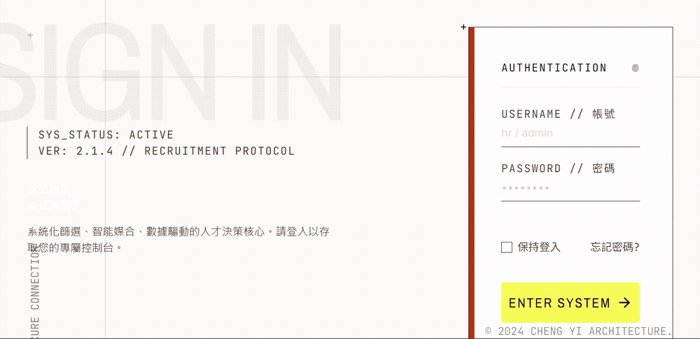

# HR Assistant

基於 Spring AI 與 RAG 的智慧招募小助手：整合履歷上傳、Embedding 向量化、pgvector 向量資料庫與自然語言問答，實現履歷內容檢索與職缺智慧匹配。



## 兩個主要功能與所用 Spring AI 技術

### 1. 履歷知識庫對話（RAG）

上傳履歷 PDF → 切塊向量化 → 對話時依語意撈出相關片段給 LLM 作答。

| 環節 | Spring AI 元件 |
|---|---|
| PDF 解析 | `PagePdfDocumentReader`（按頁讀出 `Document`） |
| 切塊 | `TokenTextSplitter`（chunkSize 800） |
| 文字轉向量 | `EmbeddingModel`（dev: Ollama／prod: Mistral） |
| 向量庫 | 自刻 `VectorStore`（`PgVectorStore`），底層用 pgvector 的 `<=>` cosine 距離 |
| 對話作答 | `ChatClient` |
| 自動檢索注入 | `QuestionAnswerAdvisor`（`/api/ai/rag`，topK 5、門檻 0.7） |
| 由 LLM 自行檢索 | Function Calling — `ResumeSearchFunction` 以 `@Description` 註冊成工具，LLM 自己決定用什麼關鍵字查幾次（`/api/ai/rag/agent`） |
| 對話記憶 | `MessageChatMemoryAdvisor` + `ChatMemory`（JDBC 持久化，以 `conversationId` 分流） |

### 2. 履歷 × 職缺匹配分析

選一份履歷 + 一個職缺 → LLM 給 0–100 分與具體理由。不走向量，履歷全文與職缺說明直接進 prompt。

| 環節 | Spring AI 元件 |
|---|---|
| 分析 | `ChatClient`（`matchChatClient`，不掛 advisor、無對話記憶，做一次性分析） |
| 結構化輸出 | `.entity(MatchResult.class)` — 直接把 LLM 回應轉成 Java record（分數 + 理由） |

## 技術棧

| 層 | 用的東西 |
|---|---|
| 後端 | Java 17、Spring Boot 3、Spring AI、Spring Data JPA |
| 資料庫 | PostgreSQL 18 + pgvector（Docker） |
| 前端 | React 18 + Vite + Tailwind |
| AI | Chat：Groq（OpenAI 相容端點）／Embedding：本機 Ollama、雲端 Mistral |

## 本機開發

### 1. 起資料庫

```powershell
docker compose up -d
```

### 2. 設定金鑰

複製 `.env.example` 成 `.env`，填入：

```
OPENAI_API_KEY=gsk_...
OPENAI_BASE_URL=https://api.groq.com/openai
POSTGRES_PASSWORD=
```

### 3. 起後端

```powershell
mvn spring-boot:run
```

驗證：<http://localhost:8087/health> 回 `{"status":"UP"}`

### 4. 起前端

```powershell
cd frontend
npm install
npm run dev
```

## 測試

```powershell
mvn test                    # 後端
cd frontend; npm test       # 前端（vitest）
```

## 部署

前端 build 後塞進 Spring Boot 的 `static/`，整包做成一個 Docker 映像丟到Render，對外只有一個網址（同源，免處理 CORS）。

| 服務 | 用途 |
|---|---|
| Render（Web Service / Docker） | 跑整包 App，`https://<name>.onrender.com` |
| Neon | Postgres + pgvector |
| Groq | Chat LLM |
| Mistral `mistral-embed` | prod 的 embedding（1024 維，schema 不用改；dev 仍用 Ollama） |

流程：改設定吃 `$PORT` + 新增 `application-prod.properties` / `Dockerfile` → 註冊 Neon / Groq / Mistral 拿金鑰 → push 到 GitHub → Render 建 Web Service 填環境變數 → 驗 `/health`。


## 專案結構

```
src/main/java/com/example/demo/
├── controller/      # API 端點（health、resume、job）
├── service/ai/      # 履歷上傳、向量檢索、職缺比對
├── model/           # Resume、JobDescription、MatchResult
└── repository/      # JPA repository
frontend/src/        # React 前端
```
